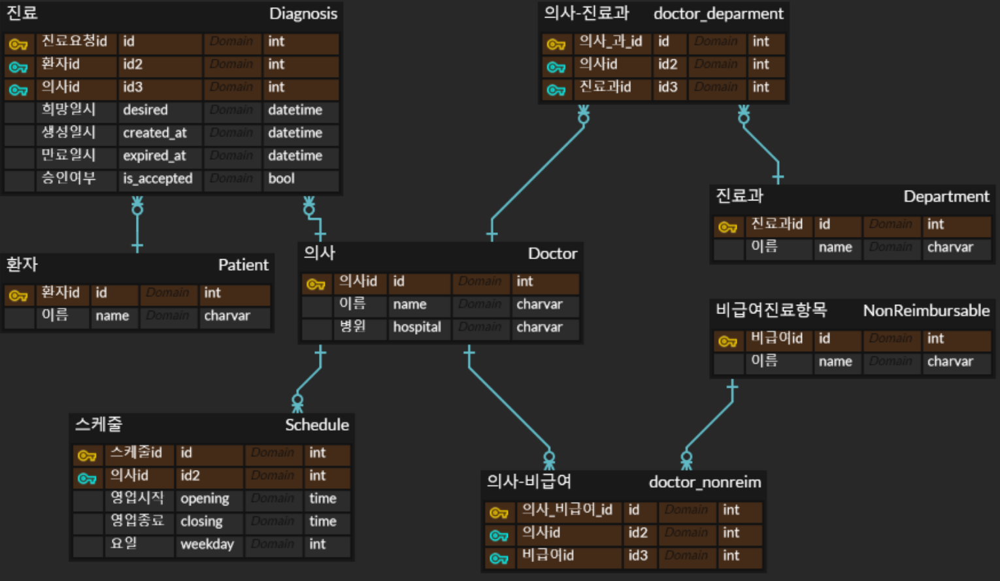

# 의료 예약 시스템
## 사용 기술
- Python
- Django
- Django Rest Framework
- SQLite3
- Swagger

## DB
- SQLite3는 Django에서 별도의 세팅없이 기본적으로 연동되어 있어서 사용하였습니다.
- ERD는 다음과 같습니다.


- 의사의 경우 진료과와 비급여항목은 여러개까지 가능하기에 각각 의사와 M:N관계로 연결하였습니다.
- 영업시간을 나타내는 스케줄 테이블에서 시작시간과 종료시간은 쉬는 시간 없이 일하는 단위를 나타냅니다.
- 만약 월요일로 시작 9시 종료 12시, 시작 13시 종료 18시라면 최종적으로 월요일은 9시부터 18시까지 영업하며 12시부터 13시까지 쉬는 시간임을 의미합니다.


## 세팅
- 먼저 클론을 받을 폴더를 생성하고 bash 혹은 shell창에 명령어를 입력합니다.
```commandline
git clone https://github.com/hamelin92/medical_appointment.git .
```
- 이후 클론받은 폴더에서 터미널을 열고 다음을 시행합니다.
```commandline
# 가상환경 세팅
source venv/Scripts/activate

# 파이썬 패키지 설치
pip install -r requirements.txt

# 마이그레이션
python manage.py makemigrations
python manage.py migrate
```
- Django 서버를 실행합니다.
```commandline
python manage.py runserver
```
## 데이터 입력
- 데이터 추출(한글 깨짐 방지)
```commandline
python -Xutf8 ./manage.py dumpdata > data.json
```
- 데이터 입력
- 필요한 경우 간단히 만들어 둔 몇가지 데이터를 DB에 넣을 수 있습니다.
```commandline
python manage.py loaddata data.json
```
- swagger 활용
- 로컬에서 서버 실행 시 http://127.0.0.1:8000/swagger/ 주소에서 API를 실행시켜 볼 수 있습니다.
- 환자, 진료과, 비급여진료항목, 의사 및 영업스케줄 입력 api가 준비되어있습니다.
- 의사 생성 api 같은 경우 영업시간일정까지 포함해서 한번에 입력할 수 있도록 만들어져 있고, 만약 영업시간을 뺴먹었다면 스케줄 생성 api로 따로 추가할 수도 있습니다.

## API 설명
- GET, /doctors - 조건에 맞는 의사를 검색하여 리스트를 반환합니다.
  - query_parameter: string, date
  - string 변수가 입력되었을 경우, 의사의 이름부터 병원, 과, 비급여 명과 전부 비교하여 해당 문자열이 포함되어 있는 경우만 필터링합니다. (대소문자 구분 X)
  - 이후 date 변수를 확인하여 입력된 날의 요일에 영업 중인 경우로 추가 필터링합니다.
  - 해당 의사의 id와 이름 목록을 반환합니다.
- POST, /doctors - 의사 데이터를 생성합니다. 의사의 영업시간 데이터까지 포함됩니다.
  - 의사이름, 병원, 진료과 리스트, 비급여 리스트, 스케줄(요일, 영업시간, 종료시간) 리스트를 json 형태로 받아 입력값에 맞는 의사 데이터를 생성합니다.
- POST, /patients - 환자 데이터를 생성합니다.
- POST, /departments - 진료과 데이터를 생성합니다.
- POST, /nonreimbursable - 비급여 진료 항목 데이터를 생성합니다.
- POST, /schedule/{doctor_id} - 해당 의사 id에 대해 스케줄 데이터를 생성합니다.
  - 요일(0~6), 오픈(시), 오픈(분), 종료(시), 종료(분)이 담긴 객체의 리스트를 입력받아 대응하는 스케줄 데이터들을 생성합니다.
- POST, /diagnosis - 진료요청을 생성합니다.
  - 만약 입력된 의사의 스케줄의 시작, 종료시각에 희망진료시간의 요일, 시간이 포함된다면 영업 중으로 판단하고 그렇지 않으면 영업시간이 아니라고 판단합니다.
  - 영업 중이 아닌 경우 같은 요일에서 희망시간 이후에 시작하는 스케줄, 또는 이후의 요일 중으로 조회할 떄 가장 처음 나오는 스케줄을 기준으로 만료시간을 설정합니다.
  - 그렇게 진료요청의 상세한 내용이 결정되면 해당 데이터를 생성합니다.
- PUT, /diagnosis - 진료 요청을 수락합니다.
  - 입력받은 진료 요청 id로 조회하여 해당 진료요청의 is_accepted 값을 True로 업데이트합니다.
- GET, /diagnosis/{doctor_id} - 해당 의사 id의 미수락 진료 요청을 전부 조회합니다.
  - 진료요청 테이블에서 의사 id와 is_accepted 값이 False인 경우에 대해서 필터링합니다.

## 추가적으로 생각해볼 수 있는 것들
- 현재는 아무런 인증, 권한 등이 없이 만들어진 상태입니다.
- 실제 서비스를 고려한다면 환자와 의사, 관리자 등이 있을 수 있고 만들어진 기능 중 상당 부분은 이런 사용자의 인증이 들어가야할 필요가 있습니다.
- DB는 편의성만을 고려하여 SQLite를 사용하였는데, 향후 어떤 방향으로 데이터의 형태가 또는 서비스가 확장되어 갈지 고민해볼 필요가 있을 것 같습니다.

